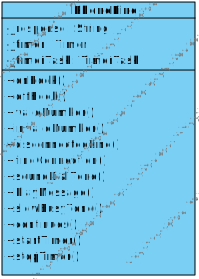
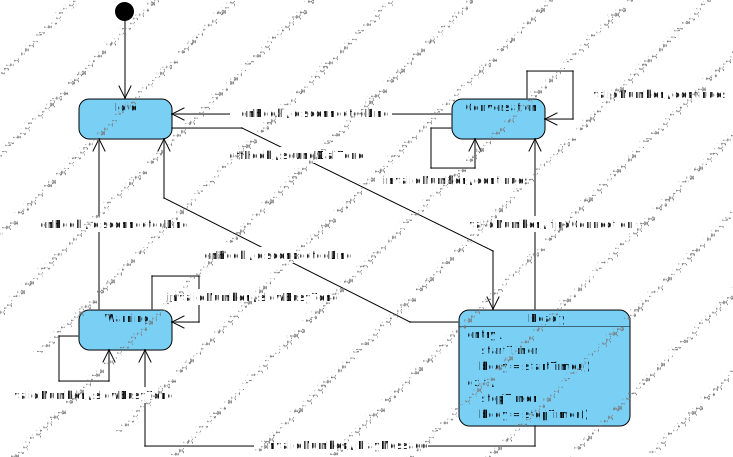

# Лабораторная работа №3
## 1. Диаграмма классов для класса PhoneLine
Была создана диаграмма классов для PhoneLine в VisualParadigm. Диаграмма представлена на рисунке ниже



## 2. Диаграмма состояний
К полученной диаграмме класса была прикручена диаграмма состояний



Итоговый файл с проектом для VisualParadigm [здесь](lab3.vpp).

## 3. Кодогенерация
Был сгенерирован шаблон кода на языке Java. В [PhoneLine.java](PhoneLine.java) были дописаны реализации и реализация [таймаута](PhoneLine.java#L65)

## 4. Доопределение
Автомат был доопределен до полностью определенного при помощи переходов по петле с выдачей **null**-реакции. Таблица переходов доопределенного автомата:

||**Idle**|**Warning**|**Conversation**|**Ready**|
|-:|:-:|:-:|:-:|:-:|
|**onHook**|Idle/null|Idle/disconnectedLine|Idle/disconnectedLine|Idle/disconnectedLine|
|**offHook**|Ready/soundDialTone|Warning/null|Conversation/null|Ready/null|
|**validNumber**|Idle/null|Warning/slowBusyTone|Conversation/continues|Conversation/findConnection|
|**invalidNumber**|Idle/null|Warning/slowBusyTone|Conversation/continues|Warning/PlayMessage|

## 5. Построение конечно-автоматной модели
Для генерации тестов, временной автомат необходимо перевести в конечный. Для этого дополнительно вводятся псевдосостояния **Ready_1** и **Ready_2**. А также входно-выходной символ **tick**, который эмулириует поступление кванта времени. Отсюда конечно-автоматная модель выглядит следующим образом:

||**Idle**|**Warning**|**Conversation**|**Ready**|**Ready_1**|**Ready_2**|
|-:|:-:|:-:|:-:|:-:|:-:|:-:|
|**onHook**|Idle/null|Idle/disconnectedLine|Idle/disconnectedLine|Idle/disconnectedLine|Idle/disconnectedLine|Idle/disconnectedLine|
|**offHook**|Ready/soundDialTone|Warning/null|Conversation/null|Ready/null|Ready/null|Ready/null|
|**validNumber**|Idle/null|Warning/slowBusyTone|Conversation/continues|Conversation/findConnection|Conversation/findConnection|Conversation/findConnection|
|**invalidNumber**|Idle/null|Warning/slowBusyTone|Conversation/continues|Warning/PlayMessage|Warning/PlayMessage|Warning/PlayMessage|
|**tick**|Idle/tick|Warning/tick|Conversation/tick|Ready_1/tick|Ready_2/tick|Warning/tick|

### Перевод в числовой формат
Прежде чем генерировать тесты, нужно от строковых идентификаторов перейти к числовым. По следующим таблицам соответствия
|**Триггер**|**id**|
|:-:|:-:|
|onHook|0|
|offHook|1|
|validNumber|2|
|invalidNumber|3|
|tick|4|

|**Реакция**|**id**|
|:-:|:-:|
|disconnectedLine|0|
|findConnection|1|
|soundDialTone|2|
|slowBusyTone|3|
|PlayMessage|4|
|continues|5|
|tick|6|
|null|7|

|**Состояние**|**id**|
|:-:|:-:|
|Idle|0|
|Warning|1|
|Conversation|2|
|Ready|3|
|Ready_1|4|
|Ready_2|5|

То бишь, конечно автоматная модель теперь будет выглядеть [так](transations2.txt)

## 6. Построение тестов
Конечно-автоматную модель из [файла}(transations2.txt) необходимо перевести в специальный формат. Так был получен файл [fsm.txt](fsm.txt). Этот файл я скормил сервису [fsmtestonline](http://fsmtestonline.ru/). Методом Wp он мне сгенерировал тесты, которые можно увидеть [здесь](tests1.txt), их, по таблицам соответствия, я перевел в [человеческий вид](tests2.txt).

## 7. Генерация юнит-тестов
По полученным [тестам](tests2.txt) при помощи [shell-скрипта](generate.sh) был получен Unit-тест (файл [PhineLineTest.java](PhineLineTest.java)) для фреймворка JUnit (немного нужно было доработать его руками). Также был добавлен [Makefile](Makefile) для запуска юнит-теста.

### Первый пробный запуск
После первого пробного запуска мы увидим следующую картину:

```bash
pavel@fedora:~/automatalab3$ make test
JUnit уже скачан
Компиляция Java файлов...
Note: Some input files use unchecked or unsafe operations.
Note: Recompile with -Xlint:unchecked for details.
Компиляция завершена успешно!
Запуск тестов...
╷
├─ JUnit Jupiter ✔
│  └─ PhoneLineTest ✔
│     ├─ TestCase10() ✔
│     ├─ TestCase11() ✔
│     ├─ TestCase12() ✔
│     ├─ TestCase13() ✔
│     ├─ TestCase14() ✔
│     ├─ TestCase15() ✔
│     ├─ TestCase16() ✔
│     ├─ TestCase17() ✔
│     ├─ TestCase18() ✔
│     ├─ TestCase19() ✔
│     ├─ TestCase20() ✔
│     ├─ TestCase21() ✔
│     ├─ TestCase22() ✔
│     ├─ TestCase23() ✔
│     ├─ TestCase24() ✔
│     ├─ TestCase25() ✔
│     ├─ TestCase26() ✔
│     ├─ TestCase27() ✔
│     ├─ TestCase28() ✔
│     ├─ TestCase29() ✔
│     ├─ TestCase30() ✔
│     ├─ TestCase31() ✘ expected: <slowBusyTone> but was: <findConnection>
│     ├─ TestCase32() ✔
│     ├─ TestCase33() ✔
│     ├─ TestCase34() ✔
│     ├─ TestCase35() ✔
│     ├─ TestCase36() ✔
│     ├─ TestCase37() ✔
│     ├─ TestCase38() ✔
│     ├─ TestCase39() ✘ expected: <slowBusyTone> but was: <findConnection>
│     ├─ TestCase40() ✘ expected: <slowBusyTone> but was: <findConnection>
│     ├─ TestCase41() ✔
│     ├─ TestCase42() ✔
│     ├─ TestCase43() ✔
│     ├─ TestCase44() ✔
│     ├─ TestCase45() ✔
│     ├─ TestCase46() ✔
│     ├─ TestCase47() ✔
│     ├─ TestCase1() ✔
│     ├─ TestCase2() ✔
│     ├─ TestCase3() ✔
│     ├─ TestCase4() ✔
│     ├─ TestCase5() ✔
│     ├─ TestCase6() ✔
│     ├─ TestCase7() ✔
│     ├─ TestCase8() ✔
│     └─ TestCase9() ✔
├─ JUnit Vintage ✔
└─ JUnit Platform Suite ✔
```
Рассмотрим, например, [40-ой тест](tests2.txt#L40), который сгенировал сервис

```
offHook/soundDialTone tick/tick tick/tick offHook/null tick/tick tick/tick validNumber/findConnection
```

видно, что был переход по символу `offHook/null`, который я убрал, т.к. в нашей диаграмме состояний такого перехода нет. Но с точки зрения конечного автомата такой переход есть и он должен был сбросить таймер, который запускается в состоянии `Ready`. Так как я убрал этот переход, то получается срабатывание таймера, которое переводит автомат в состояние `Warning`, где совершенно другая реакция на триггер `validNumber`. Поэтому все такие тесты пришлось исключить, ссылки на исключенные тесты можно найти в списке ниже:

- [Тест №31](PhineLineTest.java#L233)
- [Тест №39](PhineLineTest.java#L293)
- [Тест №40](PhineLineTest.java#L300)

### Итог
```bash
pavel@fedora:~/automatalab3$ make test
JUnit уже скачан
Компиляция Java файлов...
Note: Some input files use unchecked or unsafe operations.
Note: Recompile with -Xlint:unchecked for details.
Компиляция завершена успешно!
Запуск тестов...
╷
├─ JUnit Jupiter ✔
│  └─ PhoneLineTest ✔
│     ├─ TestCase10() ✔
│     ├─ TestCase11() ✔
│     ├─ TestCase12() ✔
│     ├─ TestCase13() ✔
│     ├─ TestCase14() ✔
│     ├─ TestCase15() ✔
│     ├─ TestCase16() ✔
│     ├─ TestCase17() ✔
│     ├─ TestCase18() ✔
│     ├─ TestCase19() ✔
│     ├─ TestCase20() ✔
│     ├─ TestCase21() ✔
│     ├─ TestCase22() ✔
│     ├─ TestCase23() ✔
│     ├─ TestCase24() ✔
│     ├─ TestCase25() ✔
│     ├─ TestCase26() ✔
│     ├─ TestCase27() ✔
│     ├─ TestCase28() ✔
│     ├─ TestCase29() ✔
│     ├─ TestCase30() ✔
│     ├─ TestCase32() ✔
│     ├─ TestCase33() ✔
│     ├─ TestCase34() ✔
│     ├─ TestCase35() ✔
│     ├─ TestCase36() ✔
│     ├─ TestCase37() ✔
│     ├─ TestCase38() ✔
│     ├─ TestCase41() ✔
│     ├─ TestCase42() ✔
│     ├─ TestCase43() ✔
│     ├─ TestCase44() ✔
│     ├─ TestCase45() ✔
│     ├─ TestCase46() ✔
│     ├─ TestCase47() ✔
│     ├─ TestCase1() ✔
│     ├─ TestCase2() ✔
│     ├─ TestCase3() ✔
│     ├─ TestCase4() ✔
│     ├─ TestCase5() ✔
│     ├─ TestCase6() ✔
│     ├─ TestCase7() ✔
│     ├─ TestCase8() ✔
│     └─ TestCase9() ✔
├─ JUnit Vintage ✔
└─ JUnit Platform Suite ✔

Test run finished after 4719 ms
[         4 containers found      ]
[         0 containers skipped    ]
[         4 containers started    ]
[         0 containers aborted    ]
[         4 containers successful ]
[         0 containers failed     ]
[        44 tests found           ]
[         0 tests skipped         ]
[        44 tests started         ]
[         0 tests aborted         ]
[        44 tests successful      ]
[         0 tests failed          ]
```
